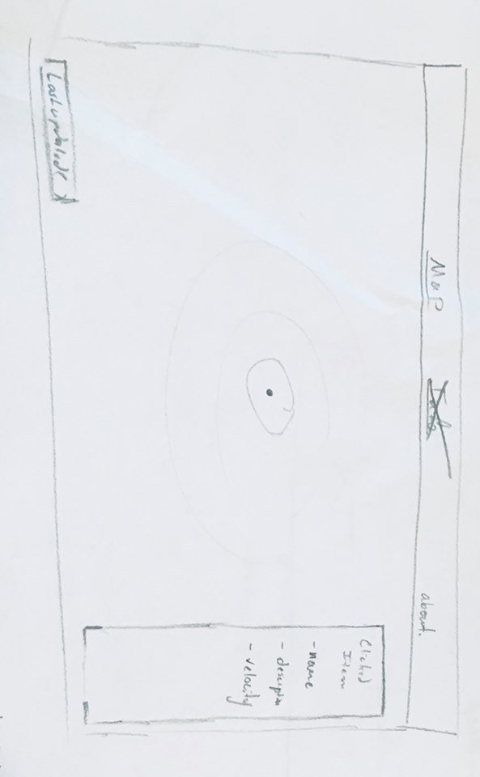

## Ever gotten tired of calculating the position of the planets on your own? How about those pesky near earth objects? Of course you have! 
The math is so repetitive and tedious. But here at SkyeLabs we have the solution for you. A one of a kind Celestial Body Tracker. 
For the amateurs or expert sky gazer, a easy to use positional application that tells you where to point your telescope. 
And the best part: it's totally and 100% free.

Project Board [Trello](https://trello.com/b/gq69Rkk2/projectocuatro) 
 ERD  
 Wireframe .